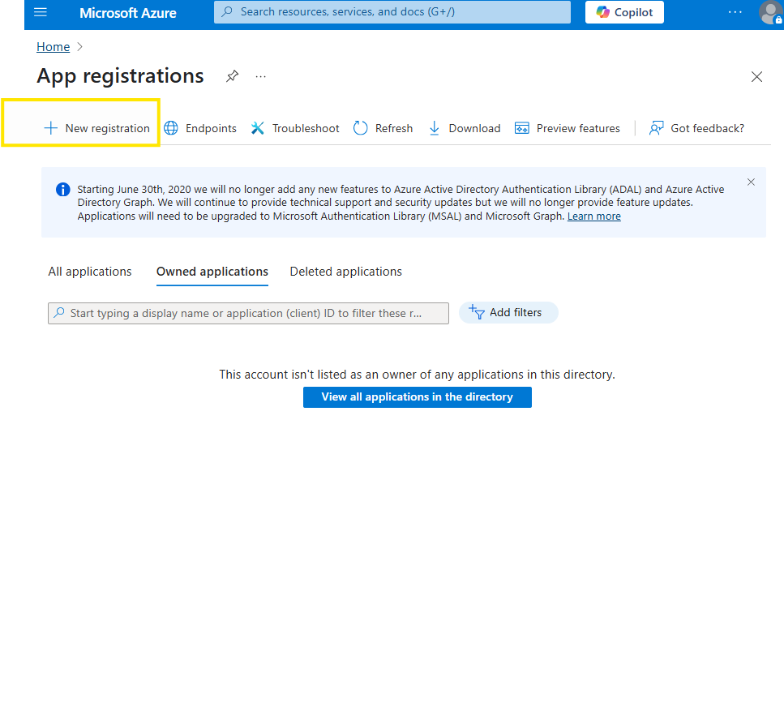
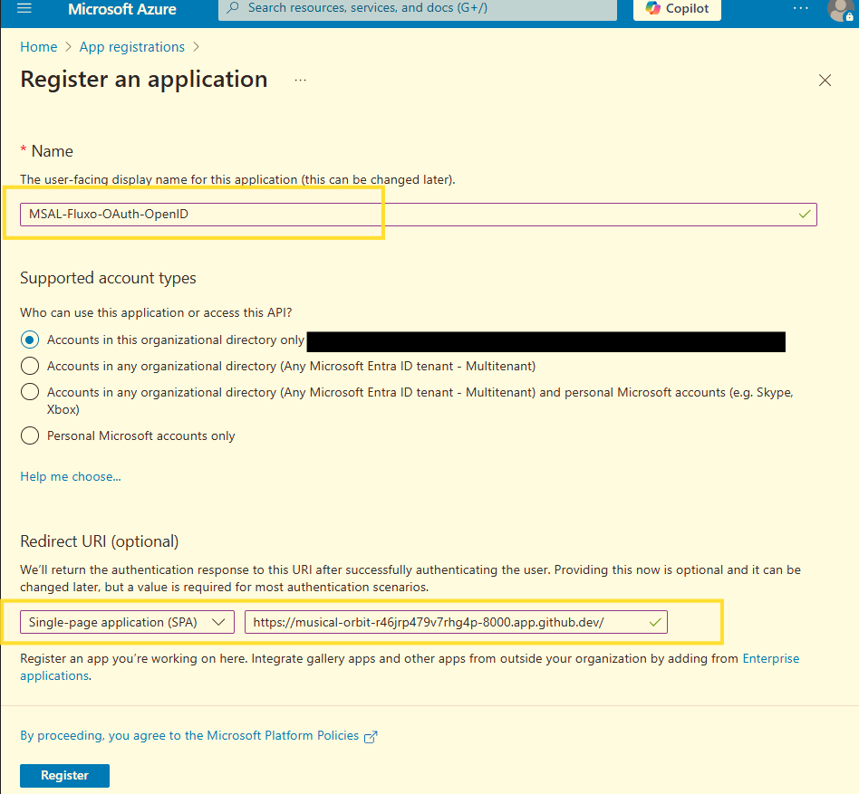
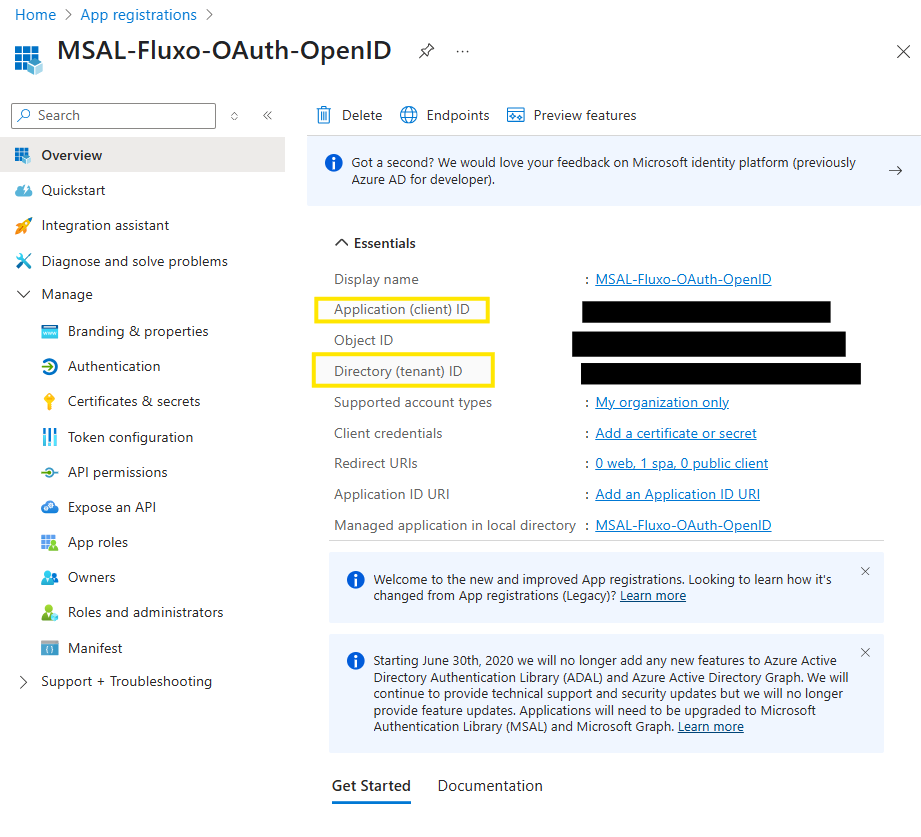
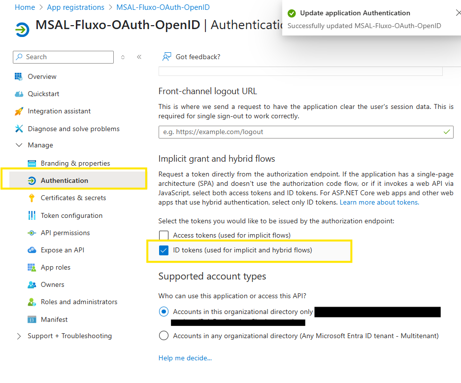
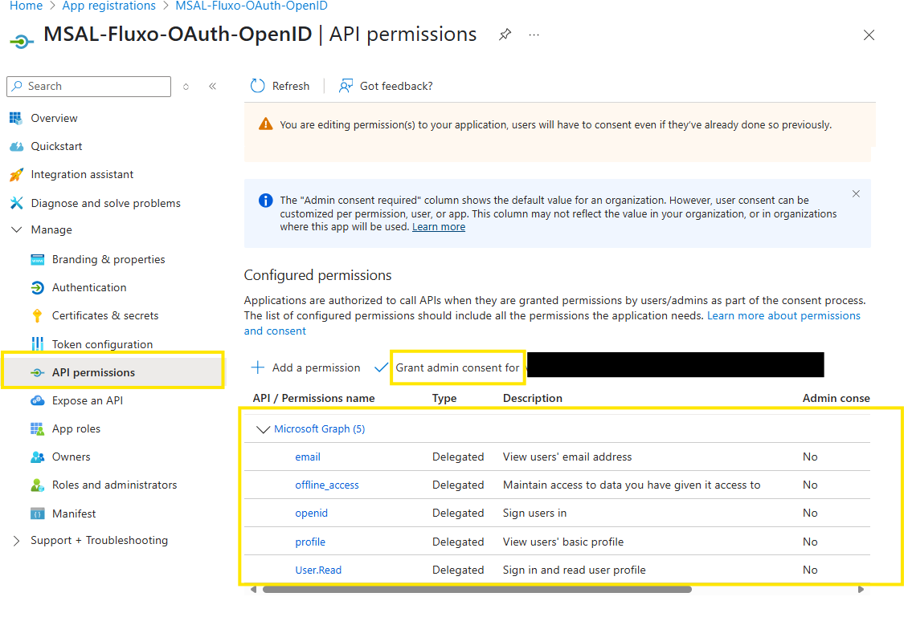
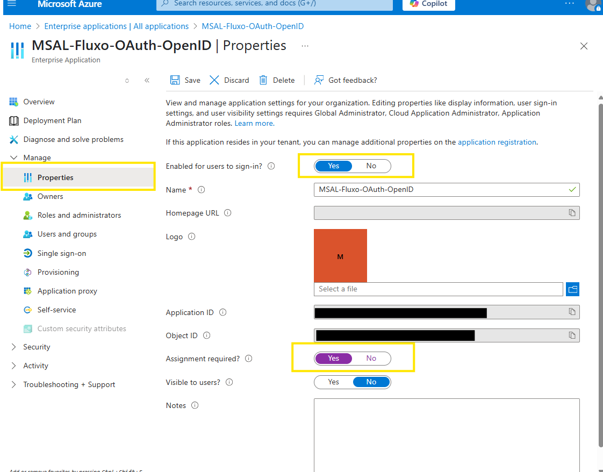
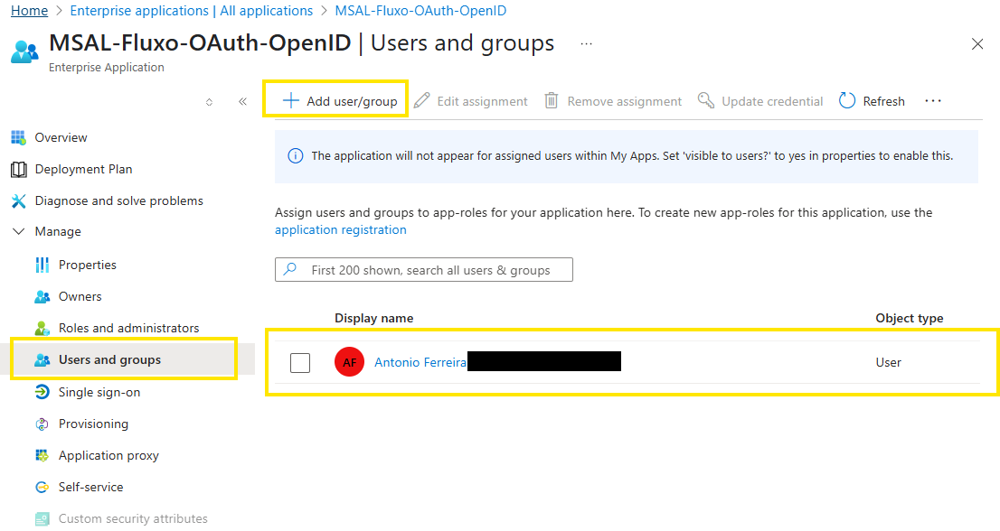

# 📘 Guide de configuration : Azure AD + MSAL.js

Ce guide vous accompagne dans la création et configuration d’une application Azure AD pour l’utiliser avec un projet MSAL.js.

---

## 📌 Étape 1 – Accéder aux inscriptions d’applications

Depuis le portail [https://portal.azure.com](https://portal.azure.com), recherchez la section **App registrations** :


---

## 🆕 Étape 2 – Créer une nouvelle application

Cliquez sur **New registration** pour démarrer :



---

## ✍️ Étape 3 – Configurer le nom et l'URL de redirection

- Choisissez un nom clair (ex : `MSAL-Fluxo-OAuth-OpenID`)
- Type de compte : en général "Accounts in this organizational directory only"
- Redirection : utilisez `Single-page application (SPA)` et l’URL de votre front-end



---

## 📋 Étape 4 – Copier le `clientId` et le `tenantId`

- Ces informations seront utilisées dans votre fichier HTML (`index.html`)



---

## 🔐 Étape 5 – Activer l’authentification implicite

- Activez la case **ID tokens** (obligatoire pour MSAL.js)
- (Optionnel) Access tokens si vous appelez une API



---

## 🧾 Étape 6 – Ajouter les permissions Microsoft Graph

Ajoutez les permissions nécessaires comme `User.Read`, `email`, `openid`, `profile` etc.



---

## 🏢 Étape 7 – Accéder à l'application d'entreprise

Revenez dans **Enterprise applications** pour gérer la partie déploiement.


---

## ⚙️ Étape 8 – Modifier les propriétés

- Activez "Assignment required" si vous voulez restreindre l’accès
- Rendez-la visible aux utilisateurs



---

## 👥 Étape 9 – Ajouter des utilisateurs ou groupes

Attribuez votre compte pour autoriser la connexion :



---

✅ **Fin de la configuration !**

Vous pouvez maintenant insérer vos identifiants dans le script `index.html` :

```js
const msalConfig = {
  auth: {
    clientId: "VOTRE_CLIENT_ID",
    authority: "https://login.microsoftonline.com/VOTRE_TENANT_ID",
    redirectUri: window.location.href
  }
};
```

Et tester votre application 🧪

🛡️ Avertissement
Ce projet est fourni à titre éducatif. Ne pas utiliser tel quel en production.
Assurez-vous de sécuriser les identifiants et de respecter les bonnes pratiques OAuth 2.0.

✨ Créé avec passion par Antonio Ferreira
